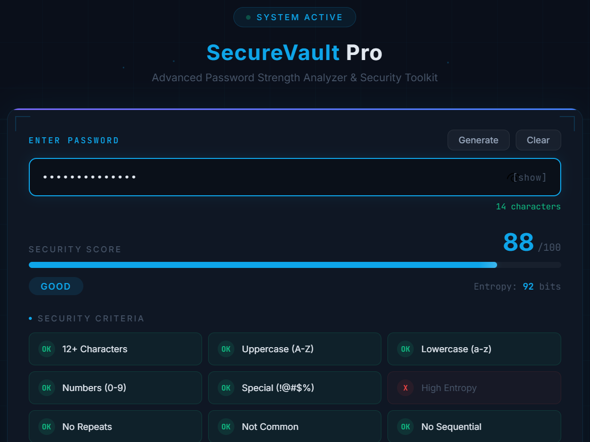
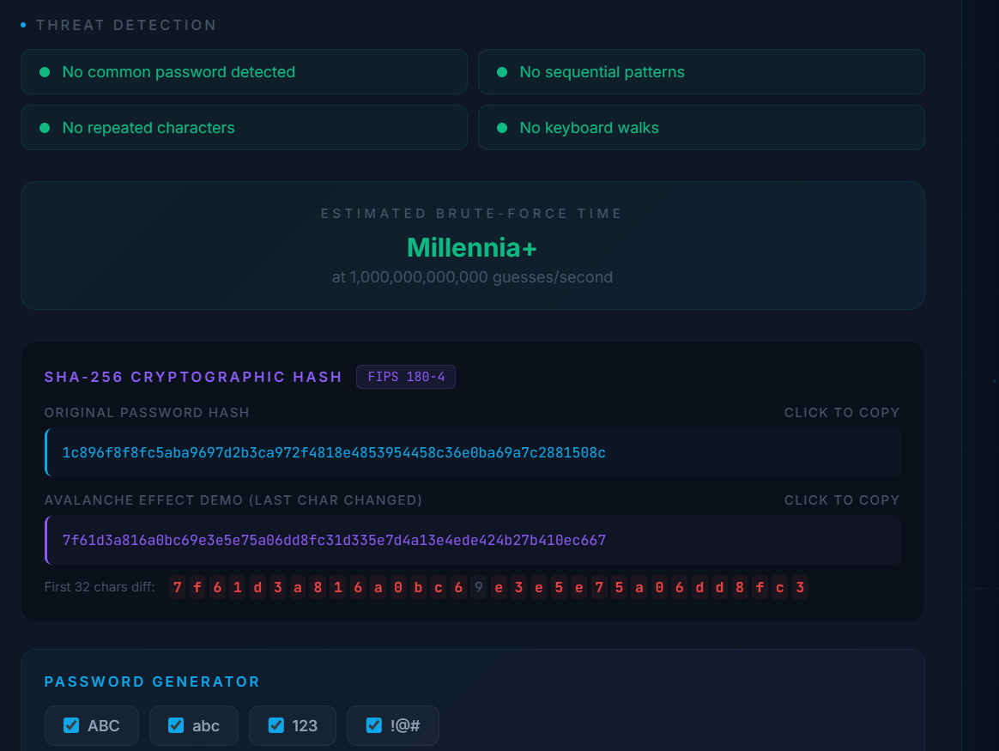
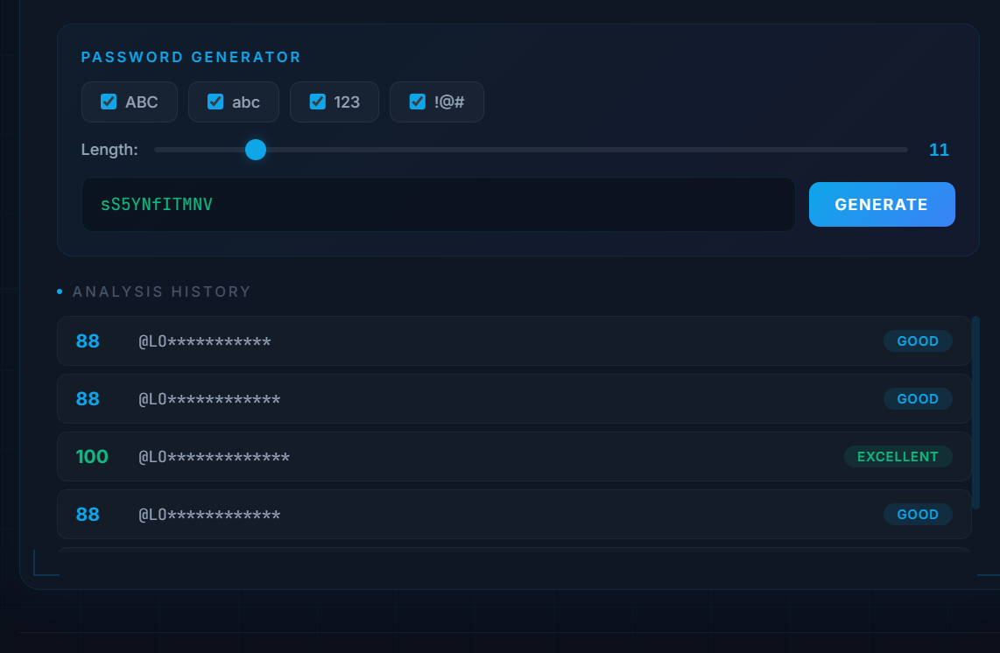

# SecureVault Pro

A professional password strength analyzer with real-time security scoring, threat detection, and cryptographic hash visualization.

## Features

- **Real-time Strength Scoring** (0-100) with animated progress bar
- **9 Security Criteria Checks**: length, uppercase, lowercase, digits, special chars, entropy, uniqueness, common passwords, sequential patterns
- **Threat Detection**: identifies common passwords, keyboard walks, sequential patterns, repeated characters
- **SHA-256 Hash Display** with avalanche effect demonstration
- **Brute-Force Time Estimation** at 100B guesses/second
- **Password Generator** with customizable length and character types
- **Analysis History** tracking last 5 passwords

## Live Demo

[View Live Demo](https://laiba-khan-13.github.io/securevault-pro/)

## Screenshots

### Password Strength Analysis

### Threat Detection

### Password Generator

## Usage

1. Open the [live demo](https://laiba-khan-13.github.io/securevault-pro/)
2. Type or generate a password
3. View real-time security analysis

## Tech Stack

- HTML5
- CSS3 (Grid, Flexbox, Animations)
- Vanilla JavaScript (Web Crypto API for SHA-256)
